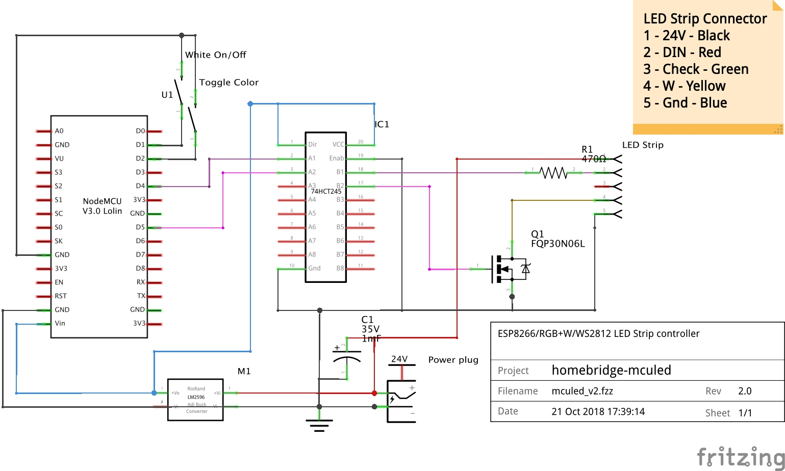
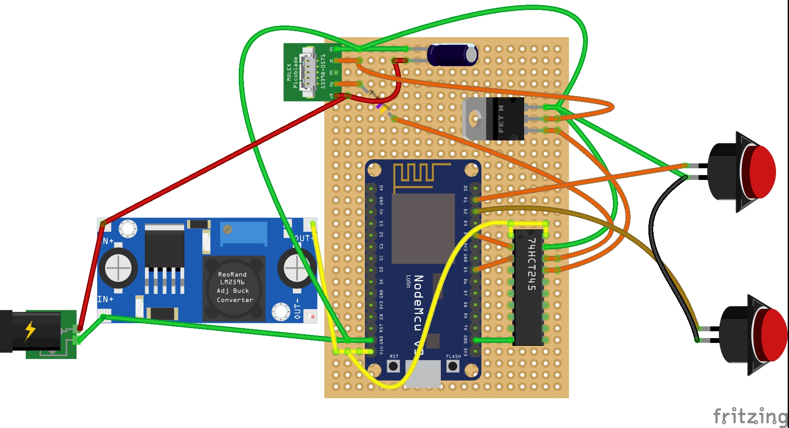
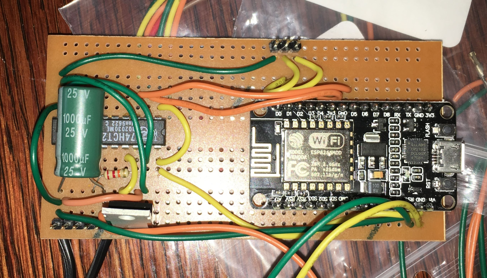
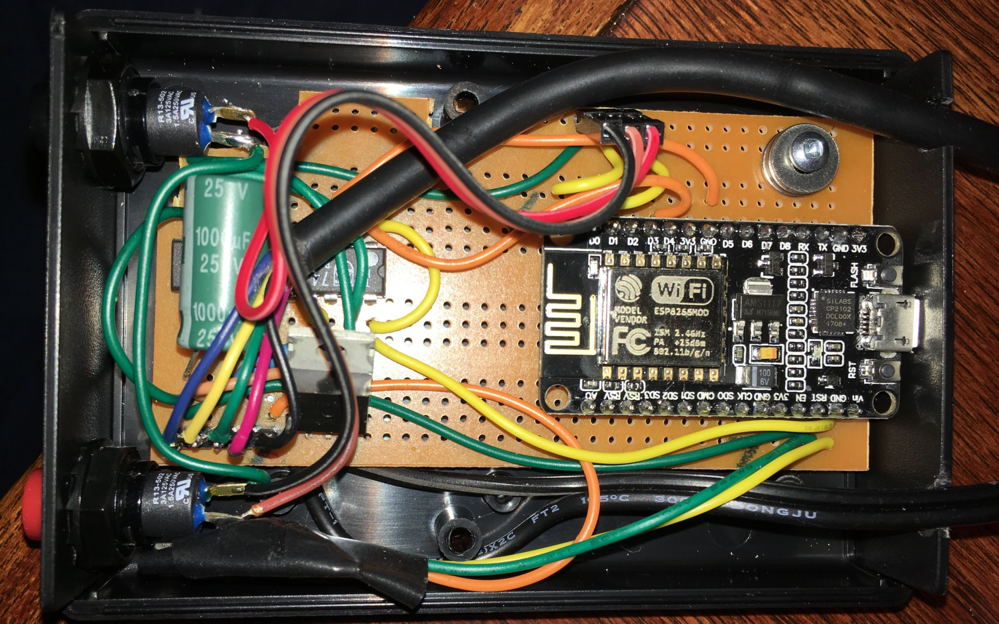

# homebridge-mculed ESP8266 LUA Code

LUA programs for a nodeMCU device to control a RGB+W LED Strip

# Hardware

1.  Bill of materials
    -   nodeMCU / esp8266 dev kit
    -   74HCT245
    -   1000uf 25V capacitor
    -   470 Ohm Resistor
    -   DC to DC Power Converter
    -   2 x Push Button switch
    -   FQP30N06L N-Channel MOSFET

# Circuit Diagrams

## CLED/Costco LED Strip










# Tools

-   nodeMCU-uploader - Install instructions are here <https://github.com/kmpm/nodeMCU-uploader>
-   lua - Install instructions are here <https://www.lua.org/download.html>
-   esptool - Install instructions are here <https://github.com/espressif/esptool>
-   esplorer - Install instructions are here <https://esp8266.ru/esplorer/>

# nodeMCU Firmware

1.  Using <http://nodeMCU-build.com>, create a custom firmware containing at least
    these modules:

    `bit,color_utils,crypto,file,gpio,mdns,net,node,pwm,sjson,tmr,uart,websocket,wifi,ws2812,ws2812_effects`


2.  Please use esptool to install the float firmware onto your nodeMCU.  There are alot of guides for this, so I won't repeat it here.

# Configuration

1.  WIFI Setup - Copy luaOTA/passwords_sample.lua to luaOTA/passwords.lua and add your wifi SSID and passwords.  Please note
    that the configuration supports multiple wifi networks, one per config line.


    module.SSID["SSID1"] = { ssid="SSID1", pwd = "password" }

2.  Copy config-NODE-AC545F.lua to your nodeMCU's name, and change the config to your model


    module.Model = "CLED"

3.  Copy ESP-NODE-AC545f.json to your nodeMCU's name, and update the file to include your config file.

# Provisioning and Running

1.  Run the script lua/luaScript/initialUpload.sh, this will upload all the lua ota provisioning files to your esp8266

2.  Start the OTA server with the script, startOtaServer.sh

3.  Using esplorer, on the nodeMCU, run the lua program initOta.lua

4. After running, the nodeMCU will reboot a couple of times then the device should start running.

# ESPlorer Snippets

## Memory

```
    print("\n------- GLOBALS --------\n")

    for k,v in pairs(_G) do print(k,v) end

    print("\n-------- REGISTRY -------\n")

    for k,v in pairs(debug.getregistry()) do print(k,v) end

    print("\n------- PACKAGES --------\n")

    table.foreach (package.loaded, print)
```
